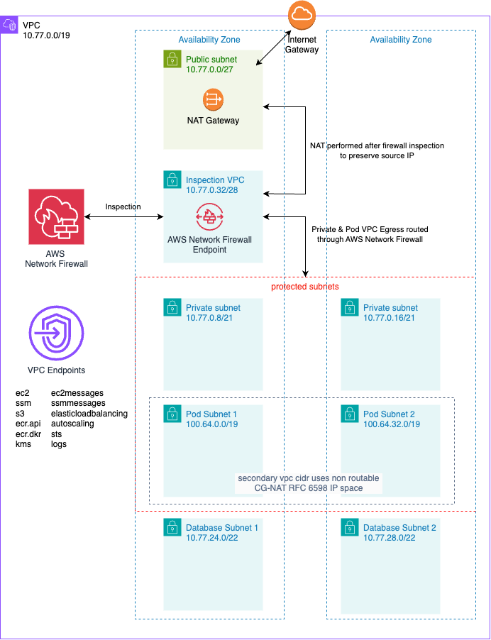

# inspection-vpc

This folder contains a [Terraform](https://www.terraform.io) module for deploying an [AWS Virtual Private Cloud (VPC)](https://docs.aws.amazon.com/vpc/latest/userguide/what-is-amazon-vpc.html). 

The VPC is designed for use in development environments and is not intended to be used in production. The module is optimized to reduce costs for non-prod VPCs at the expense of high availability, while also providing use of [AWS Network Firewall](https://aws.amazon.com/network-firewall/) and [NAT Gateway](https://docs.aws.amazon.com/vpc/latest/userguide/vpc-nat-gateway.html). 

The VPC creates "Pod Subnets" in a secondary VPC CIDR attachment as a solution for ipv4 conservation as suggested in the AWS Blog Post [*Addressing IPv4 address exhaustion in Amazon EKS clusters using private NAT gateways*.](https://aws.amazon.com/blogs/containers/addressing-ipv4-address-exhaustion-in-amazon-eks-clusters-using-private-nat-gateways/)

The VPC created looks like this:



## Examples

Minimal example:
```
module "vpc" {
  source                     = "../../terraform-aws-cxone/modules/inspection-vpc"
  deployment_id              = "bos-inspection-vpc"
  primary_cidr_block         = "10.77.0.0/16"
}
```

Full Example:

```
locals {
  fqdn = "bos-govcloud.checkmarx-ps.com"
}

module "vpc" {
  source                     = "../../terraform-aws-cxone/modules/inspection-vpc"
  deployment_id              = "bos-inspection-vpc"
  primary_cidr_block         = "10.77.0.0/16"
  interface_vpc_endpoints    = ["ec2", "ec2messages", "ssm", "ssmmessages", "ecr.api", "ecr.dkr", "kms", "logs", "sts", "elasticloadbalancing", "autoscaling"]
  create_interface_endpoints = true
  create_s3_endpoint         = true
  enable_firewall            = true
  stateful_default_action    = "aws:drop_established"
  include_sca_rules          = true
  create_managed_rule_groups = false
  managed_rule_groups = ["AbusedLegitMalwareDomainsStrictOrder",
    "MalwareDomainsStrictOrder",
    "AbusedLegitBotNetCommandAndControlDomainsStrictOrder",
    "BotNetCommandAndControlDomainsStrictOrder",
    "ThreatSignaturesBotnetStrictOrder",
    "ThreatSignaturesBotnetWebStrictOrder",
    "ThreatSignaturesBotnetWindowsStrictOrder",
    "ThreatSignaturesIOCStrictOrder",
    "ThreatSignaturesDoSStrictOrder",
    "ThreatSignaturesEmergingEventsStrictOrder",
    "ThreatSignaturesExploitsStrictOrder",
    "ThreatSignaturesMalwareStrictOrder",
    "ThreatSignaturesMalwareCoinminingStrictOrder",
    "ThreatSignaturesMalwareMobileStrictOrder",
    "ThreatSignaturesMalwareWebStrictOrder",
    "ThreatSignaturesScannersStrictOrder",
    "ThreatSignaturesSuspectStrictOrder",
    "ThreatSignaturesWebAttacksStrictOrder"
  ]
  additional_suricata_rules = <<EOF
# CxOne must talk to itself when performing token exchange to validate the FQDN (cxiam makes the connection).
pass tls $HOME_NET any -> $EXTERNAL_NET 443 (tls.sni; content:"${local.fqdn}"; startswith; nocase; endswith; msg:"matching TLS allowlisted FQDNs"; flow:to_server, established; sid:1; rev:1;)

# https/tls protocol example.com exactly
pass tls $HOME_NET any -> $EXTERNAL_NET 443 (tls.sni; content:"example.com"; startswith; nocase; endswith; msg:"matching TLS allowlisted FQDNs"; flow:to_server, established; sid:1; rev:1;)

# https/tls protocol specific subdomain of example.com
pass tls $HOME_NET any -> $EXTERNAL_NET 443 (tls.sni; content:"www.example.com"; startswith; nocase; endswith; msg:"matching TLS allowlisted FQDNs"; flow:to_server, established; sid:1; rev:1;)

# https/tls protocol any subdomain of example.com 
pass tls $HOME_NET any -> $EXTERNAL_NET 443 (tls.sni; content:".example.com"; nocase; endswith; msg:"matching TLS allowlisted FQDNs"; flow:to_server, established; sid:1; rev:1;)

EOF
}
```

## AWS Network Firewall

This module includes an option to deploy the AWS Network Firewall. When enabled, the firewall protects the private and pod subnets. The firewall stateful rules are executed in strict order. All rules are defined in [suricata format](https://docs.aws.amazon.com/network-firewall/latest/developerguide/suricata-examples.html). 

The firewall is enabled by the `enable_firewall` variable. When `enable_firewall` is false the VPC is deployed without the firewall components but still is a complete VPC with NAT Gateway for use with Checkmarx One deveopment/testing.

The module contains default rules embedded in the module. You can view those rules in [firewall-rules.tf](./firewall-rules.tf).

The embedded rules can be customized in these ways:

| Approach | Instructions |
|---|---|
| Bring your own complete rules | Provide your rules in the `suricata_rules` variable. These rules will completely replace the embedded rules. |
| Append some custom rules | Provide your rules in `additional_suricata_rules` variable. These rules will be injected into the default rules. They will be executed after the embedded rules but before the default drop rule. Use a sequence ID of `YYMMDDNNN` (where NNN is a 3 digit sequence) to ensure no SID conflicts with embedded rules. |

# Module documentation
## Requirements

| Name | Version |
|------|---------|
| <a name="requirement_terraform"></a> [terraform](#requirement\_terraform) | >= 1.6 |
| <a name="requirement_aws"></a> [aws](#requirement\_aws) | >= 5.46.0 |

## Providers

| Name | Version |
|------|---------|
| <a name="provider_aws"></a> [aws](#provider\_aws) | >= 5.46.0 |
| <a name="provider_template"></a> [template](#provider\_template) | n/a |

## Modules

| Name | Source | Version |
|------|--------|---------|
| <a name="module_vpc_endpoint_security_group"></a> [vpc\_endpoint\_security\_group](#module\_vpc\_endpoint\_security\_group) | terraform-aws-modules/security-group/aws | 5.1.2 |

## Resources

| Name | Type |
|------|------|
| [aws_cloudwatch_log_group.aws_nfw_alert](https://registry.terraform.io/providers/hashicorp/aws/latest/docs/resources/cloudwatch_log_group) | resource |
| [aws_cloudwatch_log_group.aws_nfw_flow](https://registry.terraform.io/providers/hashicorp/aws/latest/docs/resources/cloudwatch_log_group) | resource |
| [aws_eip.nat](https://registry.terraform.io/providers/hashicorp/aws/latest/docs/resources/eip) | resource |
| [aws_internet_gateway.igw](https://registry.terraform.io/providers/hashicorp/aws/latest/docs/resources/internet_gateway) | resource |
| [aws_nat_gateway.public](https://registry.terraform.io/providers/hashicorp/aws/latest/docs/resources/nat_gateway) | resource |
| [aws_networkfirewall_firewall.main](https://registry.terraform.io/providers/hashicorp/aws/latest/docs/resources/networkfirewall_firewall) | resource |
| [aws_networkfirewall_firewall_policy.main](https://registry.terraform.io/providers/hashicorp/aws/latest/docs/resources/networkfirewall_firewall_policy) | resource |
| [aws_networkfirewall_logging_configuration.main](https://registry.terraform.io/providers/hashicorp/aws/latest/docs/resources/networkfirewall_logging_configuration) | resource |
| [aws_networkfirewall_rule_group.cxone](https://registry.terraform.io/providers/hashicorp/aws/latest/docs/resources/networkfirewall_rule_group) | resource |
| [aws_route_table.firewall](https://registry.terraform.io/providers/hashicorp/aws/latest/docs/resources/route_table) | resource |
| [aws_route_table.private](https://registry.terraform.io/providers/hashicorp/aws/latest/docs/resources/route_table) | resource |
| [aws_route_table.public](https://registry.terraform.io/providers/hashicorp/aws/latest/docs/resources/route_table) | resource |
| [aws_route_table_association.firewall](https://registry.terraform.io/providers/hashicorp/aws/latest/docs/resources/route_table_association) | resource |
| [aws_route_table_association.pod](https://registry.terraform.io/providers/hashicorp/aws/latest/docs/resources/route_table_association) | resource |
| [aws_route_table_association.private](https://registry.terraform.io/providers/hashicorp/aws/latest/docs/resources/route_table_association) | resource |
| [aws_route_table_association.public](https://registry.terraform.io/providers/hashicorp/aws/latest/docs/resources/route_table_association) | resource |
| [aws_subnet.database](https://registry.terraform.io/providers/hashicorp/aws/latest/docs/resources/subnet) | resource |
| [aws_subnet.firewall](https://registry.terraform.io/providers/hashicorp/aws/latest/docs/resources/subnet) | resource |
| [aws_subnet.pod](https://registry.terraform.io/providers/hashicorp/aws/latest/docs/resources/subnet) | resource |
| [aws_subnet.private](https://registry.terraform.io/providers/hashicorp/aws/latest/docs/resources/subnet) | resource |
| [aws_subnet.public](https://registry.terraform.io/providers/hashicorp/aws/latest/docs/resources/subnet) | resource |
| [aws_vpc.main](https://registry.terraform.io/providers/hashicorp/aws/latest/docs/resources/vpc) | resource |
| [aws_vpc_endpoint.interface](https://registry.terraform.io/providers/hashicorp/aws/latest/docs/resources/vpc_endpoint) | resource |
| [aws_vpc_endpoint.s3_gateway_private](https://registry.terraform.io/providers/hashicorp/aws/latest/docs/resources/vpc_endpoint) | resource |
| [aws_vpc_ipv4_cidr_block_association.secondary_cidr_block](https://registry.terraform.io/providers/hashicorp/aws/latest/docs/resources/vpc_ipv4_cidr_block_association) | resource |
| [aws_availability_zones.available](https://registry.terraform.io/providers/hashicorp/aws/latest/docs/data-sources/availability_zones) | data source |
| [aws_partition.current](https://registry.terraform.io/providers/hashicorp/aws/latest/docs/data-sources/partition) | data source |
| [aws_region.current](https://registry.terraform.io/providers/hashicorp/aws/latest/docs/data-sources/region) | data source |
| [template_file.default_suricata_rules](https://registry.terraform.io/providers/hashicorp/template/latest/docs/data-sources/file) | data source |

## Inputs

| Name | Description | Type | Default | Required |
|------|-------------|------|---------|:--------:|
| <a name="input_additional_suricata_rules"></a> [additional\_suricata\_rules](#input\_additional\_suricata\_rules) | Additional [suricata rules](https://docs.aws.amazon.com/network-firewall/latest/developerguide/suricata-examples.html) rules to use in the network firewall. When provided these rules will be appended to the default rules prior to the default drop rule. | `string` | `""` | no |
| <a name="input_create_interface_endpoints"></a> [create\_interface\_endpoints](#input\_create\_interface\_endpoints) | Enables creation of the [interface endpoints](https://docs.aws.amazon.com/vpc/latest/privatelink/privatelink-access-aws-services.html) specified in `interface_vpc_endpoints` | `bool` | `true` | no |
| <a name="input_create_managed_rule_groups"></a> [create\_managed\_rule\_groups](#input\_create\_managed\_rule\_groups) | Enables creation of the AWS Network Firewall [managed rule groups](https://docs.aws.amazon.com/network-firewall/latest/developerguide/aws-managed-rule-groups-list.html) provided in `managed_rule_groups` | `bool` | `true` | no |
| <a name="input_create_s3_endpoint"></a> [create\_s3\_endpoint](#input\_create\_s3\_endpoint) | Enables creation of the [s3 gateway VPC endpoint](https://docs.aws.amazon.com/vpc/latest/privatelink/vpc-endpoints-s3.html) | `bool` | `true` | no |
| <a name="input_deployment_id"></a> [deployment\_id](#input\_deployment\_id) | The deployment id for the VPC which is used to name resources | `string` | n/a | yes |
| <a name="input_enable_firewall"></a> [enable\_firewall](#input\_enable\_firewall) | Enables the use of the [AWS Network Firewall](https://docs.aws.amazon.com/network-firewall/latest/developerguide/what-is-aws-network-firewall.html) to protect the private and pod subnets | `bool` | `true` | no |
| <a name="input_include_sca_rules"></a> [include\_sca\_rules](#input\_include\_sca\_rules) | Enables inclusion of AWS Network Firewall rules used in SCA scanning. These rules may be overly permissive when not using SCA, so they are optional. These rules allow connectivity to various public package manager repositories like [Maven Central](https://mvnrepository.com/repos/central) and [npm](https://docs.npmjs.com/). | `bool` | `true` | no |
| <a name="input_interface_vpc_endpoints"></a> [interface\_vpc\_endpoints](#input\_interface\_vpc\_endpoints) | A list of AWS services to create [VPC Private Endpoints](https://docs.aws.amazon.com/vpc/latest/privatelink/privatelink-access-aws-services.html) for. These endpoints are used for communication direct to AWS services without requiring connectivity and are useful for private EKS clusters. | `list(string)` | <pre>[<br>  "ec2",<br>  "ec2messages",<br>  "ssm",<br>  "ssmmessages",<br>  "ecr.api",<br>  "ecr.dkr",<br>  "kms",<br>  "logs",<br>  "sts",<br>  "elasticloadbalancing",<br>  "autoscaling"<br>]</pre> | no |
| <a name="input_managed_rule_groups"></a> [managed\_rule\_groups](#input\_managed\_rule\_groups) | The AWS Network Firewall [managed rule groups](https://docs.aws.amazon.com/network-firewall/latest/developerguide/aws-managed-rule-groups-list.html) to include in the firewall policy. Must be strict order groups. | `list(string)` | <pre>[<br>  "AbusedLegitMalwareDomainsStrictOrder",<br>  "MalwareDomainsStrictOrder",<br>  "AbusedLegitBotNetCommandAndControlDomainsStrictOrder",<br>  "BotNetCommandAndControlDomainsStrictOrder",<br>  "ThreatSignaturesBotnetStrictOrder",<br>  "ThreatSignaturesBotnetWebStrictOrder",<br>  "ThreatSignaturesBotnetWindowsStrictOrder",<br>  "ThreatSignaturesIOCStrictOrder",<br>  "ThreatSignaturesDoSStrictOrder",<br>  "ThreatSignaturesEmergingEventsStrictOrder",<br>  "ThreatSignaturesExploitsStrictOrder",<br>  "ThreatSignaturesMalwareStrictOrder",<br>  "ThreatSignaturesMalwareCoinminingStrictOrder",<br>  "ThreatSignaturesMalwareMobileStrictOrder",<br>  "ThreatSignaturesMalwareWebStrictOrder",<br>  "ThreatSignaturesScannersStrictOrder",<br>  "ThreatSignaturesSuspectStrictOrder",<br>  "ThreatSignaturesWebAttacksStrictOrder"<br>]</pre> | no |
| <a name="input_primary_cidr_block"></a> [primary\_cidr\_block](#input\_primary\_cidr\_block) | The primary VPC CIDR block for the VPC. Must be at least a /19. | `string` | n/a | yes |
| <a name="input_secondary_cidr_block"></a> [secondary\_cidr\_block](#input\_secondary\_cidr\_block) | The secondary VPC CIDR block for the EKS Pod [Custom Networking](https://aws.github.io/aws-eks-best-practices/networking/custom-networking/) configuration. Must be at least a /18. | `string` | `"100.64.0.0/18"` | no |
| <a name="input_stateful_default_action"></a> [stateful\_default\_action](#input\_stateful\_default\_action) | The [default action](https://docs.aws.amazon.com/network-firewall/latest/developerguide/suricata-rule-evaluation-order.html#suricata-strict-rule-evaluation-order) for the AWS Network Firewall stateful rule group. Choose `aws:drop_established` or `aws:alert_established` | `string` | `"aws:drop_established"` | no |
| <a name="input_suricata_rules"></a> [suricata\_rules](#input\_suricata\_rules) | The [suricata rules](https://docs.aws.amazon.com/network-firewall/latest/developerguide/suricata-examples.html) to use for the AWS Network Firewall. When provided, this variable completely overrides the embedded rules. Use this to bring your own rules. If you only need to provide some additional rules in addition to the bundled rules, then use `additional_suricata_rules` instead of `suricata_rules`. | `string` | `null` | no |

## Outputs

| Name | Description |
|------|-------------|
| <a name="output_database_subnets"></a> [database\_subnets](#output\_database\_subnets) | List of database subnet IDs in the VPC |
| <a name="output_firewall_subnets"></a> [firewall\_subnets](#output\_firewall\_subnets) | List of firewall subnet IDs in the VPC |
| <a name="output_pod_subnet_info"></a> [pod\_subnet\_info](#output\_pod\_subnet\_info) | List of map of pod subnets including `subnet_id` and `availability_zone`. Useful for creating ENIConfigs for [EKS Custom Networking](https://docs.aws.amazon.com/eks/latest/userguide/cni-custom-network.html). |
| <a name="output_pod_subnets"></a> [pod\_subnets](#output\_pod\_subnets) | List of pod subnet IDs in the VPC |
| <a name="output_private_subnets"></a> [private\_subnets](#output\_private\_subnets) | List of private subnet IDs in the VPC |
| <a name="output_public_subnets"></a> [public\_subnets](#output\_public\_subnets) | List of public subnet IDs in the VPC |
| <a name="output_vpc_cidr_blocks"></a> [vpc\_cidr\_blocks](#output\_vpc\_cidr\_blocks) | The VPC CIDR blocks of the VPC |
| <a name="output_vpc_id"></a> [vpc\_id](#output\_vpc\_id) | The id of the VPC |
