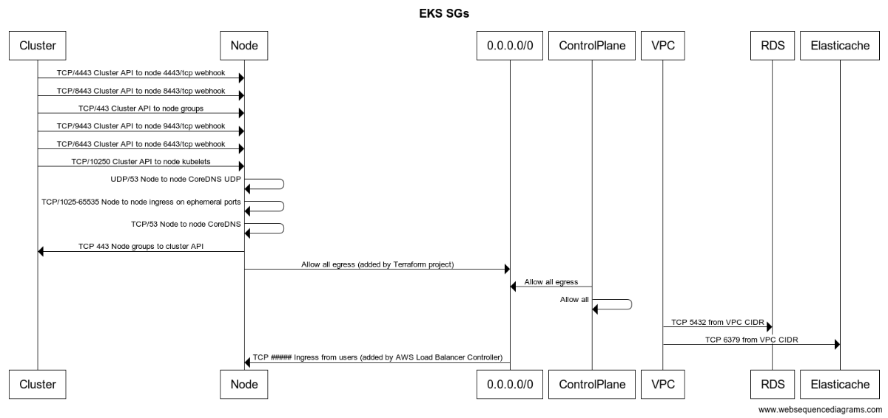

# Checkmarx One Security Groups

This module creates the following security groups used by the Checkmarx One system:

* `eks_cluster` - a security group connected to the EKS cluster (Diagram: "Cluster")
* `eks_node` - a security group connected to each node in the cluster (Diagram: "Node")
* `rds` - a security group connected to the RDS instance (Diagram: "RDS")
* `elasticache` - a security group connected to the Elasticache instance (Diagram: "Elasticache")

# Dynamic Security Group Rules

In addition to the security group configurations in this module, the following rules / groups are also created outside of this module and represented in the diagram below to attempt to provide the full security group picture.

* ControlPlane security group, created by the EKS service and attached to the ENI of the EKS COntrol Plane.
* Node egress to internet, added by the Terraform project (NOT this module), and can be customized by end users
* Node ingress from internet, added by the AWS Load Balancer Controller, and can be customized by end users.

# Security Group Diagram

